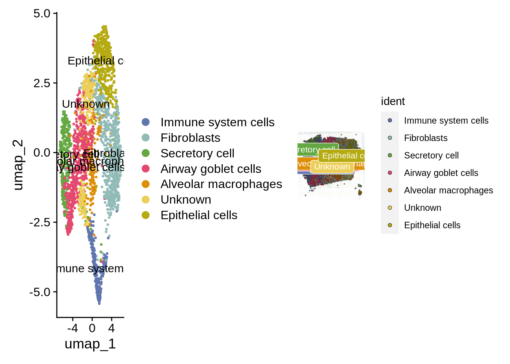
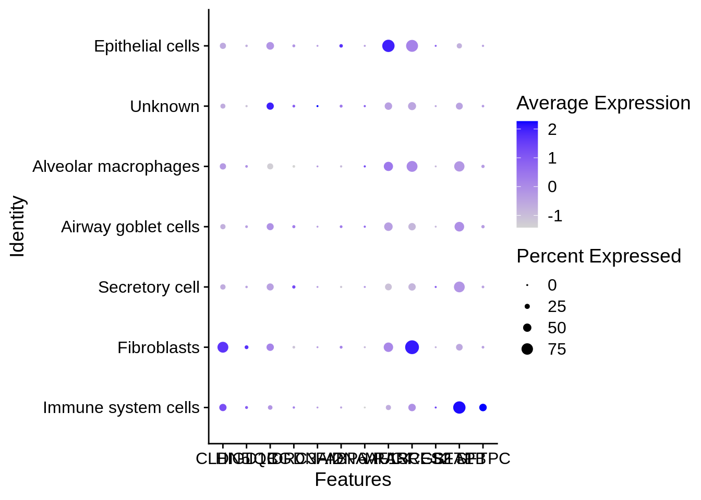

# ICGEB Workshop - Spatial Data Analysis

Participants will start with raw BCL files from the Illumina sequencing platform. Initial steps include demultiplexing samples and using Spaceranger to generate spatially resolved gene expression profiles by aligning reads, counting UMIs, and assigning spatial coordinates.

After preprocessing with Spaceranger, data is loaded into R for analysis with Seurat and additional packages. Participants will learn cell type assignment, overlaying cell types on spatial plots, manual cell type annotation, and identifying differential gene expression across tissue regions.
## Setup Instructions

### Prerequisites

1. **Install R**:
   - Download and install R from [CRAN](https://cran.r-project.org/).

2. **Install RStudio**:
   - Download and install RStudio from [RStudio](https://rstudio.com/products/rstudio/download/).


### Installing Required Packages

Open RStudio and run the following commands to install the necessary packages:

```r
install.packages(c("patchwork", "HGNChelper", "openxlsx", "data.tree", "scater", "hdf5r", "dplyr", "Seurat", "ggraph", "igraph", "tidyverse"))
BiocManager::install("rhdf5")
devtools::install_github("IanevskiAleksandr/sc-type")
```
## Step-By-Step Runthrough
### 1. **Open RMD file and set the working directory**
- In RStudio, go to _File -> Open File..._ and select the _"spatial_clustering.Rmd"_ file.
- Now we will run each code block one at a time.
- Ensure the working directory is set correctly. You can set it in the RMD file itself using:
```r
setwd("/path/to/your/directory")
```

### 2. **Load Packages**
```r
# load libraries
#p <- installed.packages()
#colnames(p)
# devtools::install_github("thomasp85/patchwork")
# install.packages('HGNChelper')
# install.packages('openxlsx')
# install.packages('data.tree')
# install.packages("hdf5r")
# install.packages('ggraph')
# install.packages("igraph")
# install.packages("tidyverse")
# install.packages('Seurat')

# BiocManager::install("scater")

list.of.packages <- c("patchwork",
                      "HGNChelper",
                      "openxlsx",
                      "data.tree",
                      "hdf5r",
                      "Seurat",
                      "ggraph",
                      "igraph",
                      "tidyverse"
                      )

#new.packages <- list.of.packages[!(list.of.packages %in% installed.packages()[,"Package"])]
#if(length(new.packages)>0) install.packages(new.packages, dependencies = T)

# BioconductoR packages
list.of.bioc.packages<- c("scater")
#new.packages.bioc <- list.of.bioc.packages[!(list.of.bioc.packages %in% installed.packages()[,"Package"])]

#if(length(new.packages.bioc)>0)if (!requireNamespace("BiocManager")) install.packages("BiocManager")
#BiocManager::install(new.packages.bioc, update = FALSE)

lapply(c(list.of.packages,list.of.bioc.packages), require, character.only = TRUE)
```
- **Output** - This block should install all the packages without any errors (ignore the Warnings)
- **Error resolution** - _"no package called 'package_name'"_ can be resolved using the command _install.packages("package_name")_


### 3. **Load Data**

example data can be downloaded from this [link] (https://csciitd-my.sharepoint.com/:u:/g/personal/bez208514_iitd_ac_in/ETuBW57TNDlPv2YLyavEJswBR-09TEvc2T2xCD5QEpp3hQ?e=czh57Q)

```r
spatial_data <- Load10X_Spatial("/Enter/your/folder/location/outs",
                                filename = "CytAssist_11mm_FFPE_Human_Lung_Cancer_filtered_feature_bc_matrix.h5",
                                assay = "RNA",
                                slice = "slice2",
                                filter.matrix = TRUE,
                                to.upper = FALSE,
                                image = NULL)

```
- **Output** - This block should load the spatial transcriptomics data. You should see an object named "_spatial_data_" in your R environment
- **Make sure your working directory PATH and data PATH are correct**


### 4. **Normalize Data**
```r
spatial_data[["percent.mt"]] <- PercentageFeatureSet(spatial_data, pattern = "^MT-")
spatial_data <- NormalizeData(spatial_data, normalization.method = "LogNormalize", scale.factor = 10000)
spatial_data <- FindVariableFeatures(spatial_data, selection.method = "vst", nfeatures = 2000)
```
- **Output** - This block normalizes the data and identifies variable features. You should see additional metadata and variable features added to the "_spatial_data_" object.


### 5. **Scale Data and Run PCA**
```r
spatial_data <- ScaleData(spatial_data, features = rownames(spatial_data))
spatial_data <- RunPCA(spatial_data, features = VariableFeatures(object = spatial_data))
```
- **Output** - This block scales the data and performs PCA. You should see PCA results stored in the spatial_data object.


### 6. **Cluster and Filter**
```r
# Check number of PC components (we selected 10 PCs for downstream analysis, based on Elbow plot)
#ElbowPlot(spatial_data)
#ElbowPlot(spatial_data)

# cluster and visualize
spatial_data <- FindNeighbors(spatial_data, dims = 1:30)
spatial_data <- FindClusters(spatial_data, resolution = 0.8)
spatial_data <- RunUMAP(spatial_data, dims = 1:30)

clusters_plot<-DimPlot(spatial_data, reduction = "umap")
cluster_of_interest <- c(1,2)
selected_markers <- FindMarkers(spatial_data, ident.1 = cluster_of_interest[1], ident.2 = cluster_of_interest[2], only.pos = TRUE, min.pct = 0.25, logfc.threshold = 0.25)

selected_filtered_genes <- subset(selected_markers, p_val_adj <= 0.5 & abs(avg_log2FC) >=1)
markers <- FindAllMarkers(spatial_data, only.pos = TRUE, min.pct = 0.25, logfc.threshold = 0.25)

filtered_genes <- subset(markers, p_val_adj <= 0.5 & abs(avg_log2FC) >=1)
filtered_genes2 <- subset(markers, p_val_adj <= 0.05)

cluster_identity <- Idents(spatial_data, Cells = all)
```

- **Sample Output**
```md
## Computing nearest neighbor graph
## Computing SNN
## Modularity Optimizer version 1.3.0 by Ludo Waltman and Nees Jan van Eck
## 
## Number of nodes: 2719
## Number of edges: 107772
## 
## Running Louvain algorithm...
## Maximum modularity in 10 random starts: 0.7744
## Number of communities: 10
## Elapsed time: 0 seconds
## 12:00:45 UMAP embedding parameters a = 0.9922 b = 1.112
## Found more than one class "dist" in cache; using the first, from namespace 'BiocGenerics'
## Also defined by 'spam'
## 12:00:45 Read 2719 rows and found 30 numeric columns
## 12:00:45 Using Annoy for neighbor search, n_neighbors = 30
## Found more than one class "dist" in cache; using the first, from namespace 'BiocGenerics'
## Also defined by 'spam'
## 12:00:45 Building Annoy index with metric = cosine, n_trees = 50
## 0%   10   20   30   40   50   60   70   80   90   100%
## [----|----|----|----|----|----|----|----|----|----|
## **************************************************|
## 12:00:45 Writing NN index file to temp file /tmp/Rtmp8PwOGO/file905a01aea1d51
## 12:00:45 Searching Annoy index using 1 thread, search_k = 3000
## 12:00:45 Annoy recall = 100%
## 12:00:46 Commencing smooth kNN distance calibration using 1 thread with target n_neighbors = 30
## 12:00:46 Initializing from normalized Laplacian + noise (using RSpectra)
## 12:00:46 Commencing optimization for 500 epochs, with 118816 positive edges
## 12:00:49 Optimization finished
## Calculating cluster 0
## Calculating cluster 1
## Calculating cluster 2
## Calculating cluster 3
## Calculating cluster 4
## Calculating cluster 5
## Calculating cluster 6
## Calculating cluster 7
## Calculating cluster 8
## Calculating cluster 9
```


### 7. **Cell Type Assignment - Annotations**
```r
# CELL TYPE ASSIGNMENT
# load gene set preparation function
#source("https://raw.githubusercontent.com/IanevskiAleksandr/sc-type/master/R/gene_sets_prepare.R")
# load cell type annotation function
# load gene set preparation function
source("https://raw.githubusercontent.com/IanevskiAleksandr/sc-type/master/R/gene_sets_prepare.R")
# load cell type annotation function
source("https://raw.githubusercontent.com/IanevskiAleksandr/sc-type/master/R/sctype_score_.R")

#source("~/Downloads/sctype_score_.R")
#source("~/Downloads/gene_sets_prepare.R")

#In addition, provide a tissue type your data belongs to:
# DB file
db_ = "https://raw.githubusercontent.com/IanevskiAleksandr/sc-type/master/ScTypeDB_full.xlsx";

#auto-detect tissue
source("https://raw.githubusercontent.com/IanevskiAleksandr/sc-type/master/R/auto_detect_tissue_type.R")
#tissue_guess = auto_detect_tissue_type(path_to_db_file = db_, seuratObject = spatial_data, scaled = TRUE, assay = "RNA")  # if scaled = TRUE, make sure the data is scaled, as seuratObject[[assay]]@scale.data is used. If you just created a Seurat object, without any scaling and normalization, set scaled = FALSE, seuratObject[[assay]]@counts will be used         

# Select tissue type : Default: "Immune system"
# we could make a drop-down for this
tissue = "Lung" # e.g. Immune system,Pancreas,Liver,Eye,Kidney,Brain,Lung,Adrenal,Heart,Intestine,Muscle,Placenta,Spleen,Stomach,Thymus 

# prepare gene sets
gs_list = gene_sets_prepare(db_, tissue)


#ASSIGN CELL-TYPES TO CLUSTERS
# get cell-type by cell matrix

#es.max = sctype_score(scRNAseqData = spatial_data[["RNA"]]@scale.data, scaled = TRUE,gs = gs_list$gs_positive, gs2 = gs_list$gs_negative) 

#es.max = sctype_score(scRNAseqData = spatial_data@assays[["RNA"]]@layers[["scale.data"]] , scaled = TRUE,gs = gs_list$gs_positive, gs2 = gs_list$gs_negative) 
spatial_data[["RNA3"]] <- as(object = spatial_data[["RNA"]], Class = "Assay")

es.max = sctype_score(scRNAseqData = spatial_data[["RNA3"]]@scale.data,
                      scaled = TRUE,
                      gs = gs_list$gs_positive,
                      gs2 = gs_list$gs_negative)


# NOTE: scRNAseqData parameter should correspond to your input scRNA-seq matrix. 
# In case Seurat is used, it is either spatial_data[["RNA"]]@scale.data (default), spatial_data[["SCT"]]@scale.data, in case sctransform is used for normalization,
# or spatial_data[["integrated"]]@scale.data, in case a joint analysis of multiple single-cell datasets is performed.

# merge by cluster
cL_resutls = do.call("rbind", lapply(unique(spatial_data@meta.data$seurat_clusters), function(cl){
  es.max.cl = sort(rowSums(es.max[ ,rownames(spatial_data@meta.data[spatial_data@meta.data$seurat_clusters==cl, ])]), decreasing = !0)
  head(data.frame(cluster = cl, type = names(es.max.cl), scores = es.max.cl, ncells = sum(spatial_data@meta.data$seurat_clusters==cl)), 10)
}))
sctype_scores = cL_resutls %>% group_by(cluster) %>% top_n(n = 1, wt = scores)  

# set low-confident (low ScType score) clusters to "unknown"
sctype_scores$type[as.numeric(as.character(sctype_scores$scores)) < sctype_scores$ncells/4] = "Unknown"
print(sctype_scores[,1:3])
```
- **Sample Output**
```r
## # A tibble: 10 × 3
## # Groups:   cluster [10]
##    cluster type                 scores
##    <fct>   <chr>                 <dbl>
##  1 6       Immune system cells   761. 
##  2 1       Fibroblasts          1215. 
##  3 5       Secretory cell        173. 
##  4 2       Fibroblasts           241. 
##  5 4       Airway goblet cells    84.4
##  6 3       Airway goblet cells   272. 
##  7 7       Alveolar macrophages   74.0
##  8 8       Unknown                37.0
##  9 0       Epithelial cells      163. 
## 10 9       Unknown               -27.7
```


### 8. **Plotting and Visualizations**
```r
## OVERLAYING IDENTIFIED CELL-TYPES ON PLOTS
spatial_data@meta.data$customclassif = ""
for(j in unique(sctype_scores$cluster)){
  cl_type = sctype_scores[sctype_scores$cluster==j,]; 
  spatial_data@meta.data$customclassif[spatial_data@meta.data$seurat_clusters == j] = as.character(cl_type$type[1])
}

#DimPlot(spatial_data, reduction = "umap", label = TRUE, repel = TRUE, group.by = 'customclassif')

ccolss= c("#5f75ae","#92bbb8","#64a841","#e5486e","#de8e06","#eccf5a","#b5aa0f","#e4b680","#7ba39d","#b15928","#ffff99", "#6a3d9a","#cab2d6","#ff7f00","#fdbf6f","#e31a1c","#fb9a99","#33a02c","#b2df8a","#1f78b4","#a6cee3")

# UMAP and spatial plot with inferred cell-types
Idents(spatial_data)=spatial_data@meta.data$customclassif
p1 <- DimPlot(spatial_data, reduction = "umap", label = TRUE, cols = ccolss)
names(ccolss) <- unique(Idents(spatial_data))
p2 <- SpatialDimPlot(spatial_data, label = TRUE, label.size = 3, cols = ccolss)
p1 + p2
```
- **Sample Output**



### 9. **Dot Plot Visualizations**
```r
DotPlot(spatial_data, features = c("CLDN5","HIGD1B","IQCG","DRC3","DNAI2","FABP6","DNAAF1","MUC4","RARRES2","SCGB1A1","SFTPA2","SFTPB","SFTPC"), dot.scale = 4) #ACC_markers_fromGSEA
```
- **Sample Output**



### 10. **Dot Plot - 2**
```r
DotPlot(spatial_data, features = c("CLDN5","HIGD1B","IQCG","DRC3","DNAI2","FABP6","DNAAF1","MUC4","RARRES2","SCGB1A1","SFTPA2","SFTPB","SFTPC"), dot.scale = 4) #ACC_markers_fromGSEA
```
- **Sample Output**

