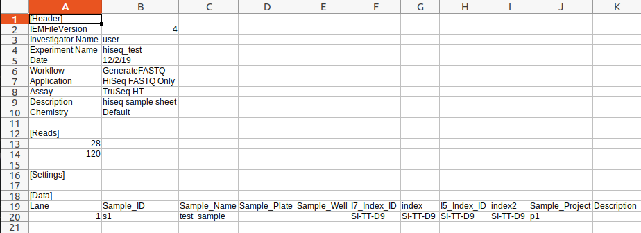
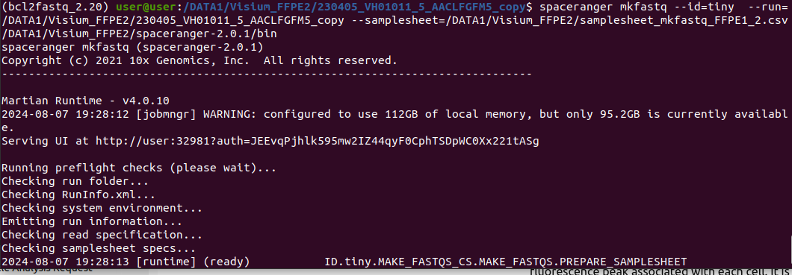
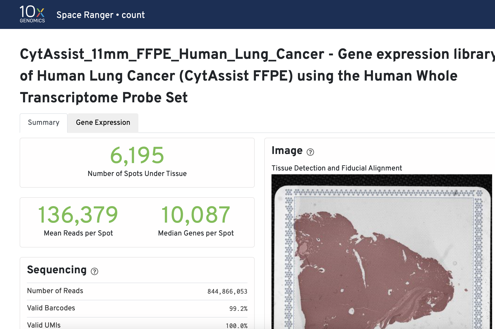
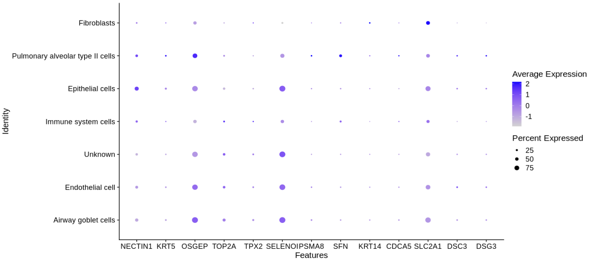

# ICGEB Workshop - Spatial Data Analysis

Post sequencing of spatial transcriptomics libraries, raw BCL files are obtained from the Illumina sequencing platform. Initial steps include demultiplexing samples and using Spaceranger to generate spatially resolved gene expression profiles by aligning reads, counting UMIs, and assigning spatial coordinates.

After preprocessing with Spaceranger, data is loaded into R for analysis with Seurat and additional packages. Participants will learn cell type assignment, overlaying cell types on spatial plots, manual cell type annotation, and identifying differential gene expression across tissue regions.

 
Reference [link](https://www.10xgenomics.com/support/software/space-ranger/latest/analysis/inputs/fastqs-generating-fastqs)

## Spaceranger run

1. BCL files are demultiplexed using a samplesheet.csv file that contains sample index IDs/sequences for different samples pooled together for sequencing on Illumina platform. This is done using spaceranger mkfastq function.
```
spaceranger mkfastq --id=tiny-bcl \
                    --run=the path of Illumina BCL run folder \
                    --csv=spaceranger-tiny-bcl-simple-1.0.0.csv
```
Example samplesheet:



Running spaceranger mkfastq:

```
#switch from base environment to bcl2fastq environment
conda activate bcl2fastq_2.20
```
Example BCL file screenshot:




## Summary of the spatial sequencing run

[](https://cf.10xgenomics.com/samples/spatial-exp/2.0.1/CytAssist_11mm_FFPE_Human_Lung_Cancer/CytAssist_11mm_FFPE_Human_Lung_Cancer_web_summary.html)

## Setup Instructions

### Prerequisites

1. **Install R**:
   - Download and install R from [CRAN](https://cran.r-project.org/).

2. **Install RStudio**:
   - Download and install RStudio from [RStudio](https://rstudio.com/products/rstudio/download/).


## Step-By-Step Runthrough
### 1. **Open RMD file and set the working directory**
- In RStudio, go to _File -> Open File..._ and select the _"spatial_clustering.Rmd"_ file.
- Now we will run each code block one at a time.
- Ensure the working directory is set correctly. You can set it in the RMD file itself using:

```r
setwd("/path/to/your/directory")
```

### 2. **Load Packages**
```r
# load libraries
#p <- installed.packages()
#colnames(p)
# devtools::install_github("thomasp85/patchwork")
# install.packages('HGNChelper')
# install.packages('openxlsx')
# install.packages('data.tree')
# install.packages("hdf5r")
# install.packages('ggraph')
# install.packages("igraph")
# install.packages("tidyverse")
# install.packages('Seurat')

# BiocManager::install("scater")

list.of.packages <- c("patchwork",
                      "HGNChelper",
                      "openxlsx",
                      "data.tree",
                      "hdf5r",
                      "Seurat",
                      "ggraph",
                      "igraph",
                      "tidyverse"
                      )

#new.packages <- list.of.packages[!(list.of.packages %in% installed.packages()[,"Package"])]
#if(length(new.packages)>0) install.packages(new.packages, dependencies = T)

# BioconductoR packages
list.of.bioc.packages<- c("scater")
#new.packages.bioc <- list.of.bioc.packages[!(list.of.bioc.packages %in% installed.packages()[,"Package"])]

#if(length(new.packages.bioc)>0)if (!requireNamespace("BiocManager")) install.packages("BiocManager")
#BiocManager::install(new.packages.bioc, update = FALSE)

lapply(c(list.of.packages,list.of.bioc.packages), require, character.only = TRUE)
```
- **Output** - This block should install all the packages without any errors (ignore the Warnings)
- **Error resolution** - _"no package called 'package_name'"_ can be resolved using the command _install.packages("package_name")_


### 3. **Load Data**

example data can be downloaded from this [link](https://csciitd-my.sharepoint.com/my?id=%2Fpersonal%2Fbez208514%5Fiitd%5Fac%5Fin%2FDocuments%2FICGEB%5Fworkshop&FolderCTID=0x012000B659D501CD9AC245929B050DAB0630DF)
```r
spatial_data <- Load10X_Spatial("/Enter/your/folder/location/outs",
                                filename = "CytAssist_11mm_FFPE_Human_Lung_Cancer_filtered_feature_bc_matrix.h5",
                                assay = "RNA",
                                slice = "slice2",
                                filter.matrix = TRUE,
                                to.upper = FALSE,
                                image = NULL)

```
- **Output** - This block should load the spatial transcriptomics data. You should see an object named "_spatial_data_" in your R environment
- **Make sure your working directory PATH and data PATH are correct**


### 4. **Normalize Data**
```r
spatial_data[["percent.mt"]] <- PercentageFeatureSet(spatial_data, pattern = "^MT-")
spatial_data <- NormalizeData(spatial_data, normalization.method = "LogNormalize", scale.factor = 10000)
spatial_data <- FindVariableFeatures(spatial_data, selection.method = "vst", nfeatures = 2000)
```
- **Output** - This block normalizes the data and identifies variable features. You should see additional metadata and variable features added to the "_spatial_data_" object.
- **Understanding code** - These lines process spatial transcriptomics data in three steps. First, they calculate the percentage of mitochondrial gene expression to identify potentially stressed or dead cells, which can affect data quality. Next, they normalize the gene expression data to make levels comparable across cells, accounting for technical variations. Here, we have used "_LogNormalize_" method as it stabilizes variance and technical noise across a wide range of gene expression values. Finally, they identify the top 2,000 most variable genes, focusing on those with significant expression changes, which are likely to be biologically informative and useful for further analysis.


### 5. **Scale Data and Run PCA**
```r
spatial_data <- ScaleData(spatial_data, features = rownames(spatial_data))
spatial_data <- RunPCA(spatial_data, features = VariableFeatures(object = spatial_data))
```
- **Output** - This block scales the data and performs PCA. You should see PCA results stored in the spatial_data object.
- **Understanding the code** - Code ensures that data is subsequently scaled to standardize gene expression levels, making genes comparable by removing biases due to different expression ranges. Finally, Principal Component Analysis (PCA) is performed on these variable features to reduce dimensionality, preserving significant variability and highlighting essential patterns for downstream clustering and visualization. These steps collectively ensure robust, accurate, and insightful analysis of spatial transcriptomics data.


### 6. **Cluster and Filter**
#### Clustering
```r
# Check number of PC components (we selected 10 PCs for downstream analysis, based on Elbow plot)
#ElbowPlot(spatial_data)
#ElbowPlot(spatial_data)

# cluster and visualize
spatial_data <- FindNeighbors(spatial_data, dims = 1:30)
spatial_data <- FindClusters(spatial_data, resolution = 0.8)
spatial_data <- RunUMAP(spatial_data, dims = 1:30)
```
- **Understanding code** - These lines construct a shared nearest neighbor graph (FindNeighbors) using the top 30 PCs and identify clusters within the data (FindClusters) with a resolution parameter set to 0.8. This step groups cells into clusters based on their gene expression profiles, enabling the identification of distinct cell populations.

#### Visualization
```r
clusters_plot<-DimPlot(spatial_data, reduction = "umap")
cluster_of_interest <- c(1,2)
selected_markers <- FindMarkers(spatial_data, ident.1 = cluster_of_interest[1], ident.2 = cluster_of_interest[2], only.pos = TRUE, min.pct = 0.25, logfc.threshold = 0.25)
```
- **Understanding code** - UMAP (Uniform Manifold Approximation and Projection) is used to reduce the dimensionality of the data and visualize clusters in a 2D space. The DimPlot function generates a plot showing the spatial distribution of these clusters. UMAP helps in visualizing the complex high-dimensional data in a comprehensible manner, highlighting the relationships between different cell clusters.

Seurat can help you find markers that define clusters via differential expression (DE). By default, it identifies positive and negative markers of a single cluster (specified in ident.1, ident.2), compared to all other cells. 

#### Marker Gene Identification
```r
selected_filtered_genes <- subset(selected_markers, p_val_adj <= 0.5 & abs(avg_log2FC) >=1)
markers <- FindAllMarkers(spatial_data, only.pos = TRUE, min.pct = 0.25, logfc.threshold = 0.25)

filtered_genes <- subset(markers, p_val_adj <= 0.5 & abs(avg_log2FC) >=1)
filtered_genes2 <- subset(markers, p_val_adj <= 0.05)

cluster_identity <- Idents(spatial_data, Cells = all)
```
- **Understanding code** - These lines identify marker genes that distinguish between clusters of interest. The FindMarkers function compares two clusters (1 and 2 in this case) to find genes that are significantly differentially expressed, selecting those with a minimum percentage (min.pct) and log-fold change (logfc.threshold). Further filtering refines the list of significant marker genes based on adjusted p-values and expression changes. Identifying marker genes helps in understanding the biological characteristics and differences between cell clusters. It finally assigns each cell to a specific cluster, providing a comprehensive overview of the cell population's structure.

- **Sample Output**
```md
## Computing nearest neighbor graph
## Computing SNN
## Modularity Optimizer version 1.3.0 by Ludo Waltman and Nees Jan van Eck
## 
## Number of nodes: 2719
## Number of edges: 107772
## 
## Running Louvain algorithm...
## Maximum modularity in 10 random starts: 0.7744
## Number of communities: 10
## Elapsed time: 0 seconds
## 12:00:45 UMAP embedding parameters a = 0.9922 b = 1.112
## Found more than one class "dist" in cache; using the first, from namespace 'BiocGenerics'
## Also defined by 'spam'
## 12:00:45 Read 2719 rows and found 30 numeric columns
## 12:00:45 Using Annoy for neighbor search, n_neighbors = 30
## Found more than one class "dist" in cache; using the first, from namespace 'BiocGenerics'
## Also defined by 'spam'
## 12:00:45 Building Annoy index with metric = cosine, n_trees = 50
## 0%   10   20   30   40   50   60   70   80   90   100%
## [----|----|----|----|----|----|----|----|----|----|
## **************************************************|
## 12:00:45 Writing NN index file to temp file /tmp/Rtmp8PwOGO/file905a01aea1d51
## 12:00:45 Searching Annoy index using 1 thread, search_k = 3000
## 12:00:45 Annoy recall = 100%
## 12:00:46 Commencing smooth kNN distance calibration using 1 thread with target n_neighbors = 30
## 12:00:46 Initializing from normalized Laplacian + noise (using RSpectra)
## 12:00:46 Commencing optimization for 500 epochs, with 118816 positive edges
## 12:00:49 Optimization finished
## Calculating cluster 0
## Calculating cluster 1
## Calculating cluster 2
## Calculating cluster 3
## Calculating cluster 4
## Calculating cluster 5
## Calculating cluster 6
## Calculating cluster 7
## Calculating cluster 8
## Calculating cluster 9
```


### 7. **Cell Type Assignment - Annotations**

#### Loading Database and Prerequisite files
```r
# CELL TYPE ASSIGNMENT
# load gene set preparation function
#source("https://raw.githubusercontent.com/IanevskiAleksandr/sc-type/master/R/gene_sets_prepare.R")
# load cell type annotation function
# load gene set preparation function
source("https://raw.githubusercontent.com/IanevskiAleksandr/sc-type/master/R/gene_sets_prepare.R")
# load cell type annotation function
source("https://raw.githubusercontent.com/IanevskiAleksandr/sc-type/master/R/sctype_score_.R")

#source("~/Downloads/sctype_score_.R")
#source("~/Downloads/gene_sets_prepare.R")

#In addition, provide a tissue type your data belongs to:
# DB file
db_ = "https://raw.githubusercontent.com/IanevskiAleksandr/sc-type/master/ScTypeDB_full.xlsx";
```
- **Understanding Code** - These lines load the R scripts for gene set preparation and cell type annotation directly from a GitHub repository. The source function is used to execute the R scripts from the provided URLs.


#### Detecting Tissue-type
```r
#auto-detect tissue
source("https://raw.githubusercontent.com/IanevskiAleksandr/sc-type/master/R/auto_detect_tissue_type.R")
#tissue_guess = auto_detect_tissue_type(path_to_db_file = db_, seuratObject = spatial_data, scaled = TRUE, assay = "RNA")  # if scaled = TRUE, make sure the data is scaled, as seuratObject[[assay]]@scale.data is used. If you just created a Seurat object, without any scaling and normalization, set scaled = FALSE, seuratObject[[assay]]@counts will be used         

# Select tissue type : Default: "Immune system"
# we could make a drop-down for this
tissue = "Lung" # e.g. Immune system,Pancreas,Liver,Eye,Kidney,Brain,Lung,Adrenal,Heart,Intestine,Muscle,Placenta,Spleen,Stomach,Thymus 
```
- **Understanding Code** - This part sources the script for auto-detecting the tissue type. The commented line shows how to use the auto_detect_tissue_type function to guess the tissue type of the data based on the provided database file and the Seurat object containing the spatial transcriptomics data


#### Prepare Gene Sets and assign cell type
```r
# prepare gene sets
gs_list = gene_sets_prepare(db_, tissue)


#ASSIGN CELL-TYPES TO CLUSTERS
# get cell-type by cell matrix

#es.max = sctype_score(scRNAseqData = spatial_data[["RNA"]]@scale.data, scaled = TRUE,gs = gs_list$gs_positive, gs2 = gs_list$gs_negative) 

#es.max = sctype_score(scRNAseqData = spatial_data@assays[["RNA"]]@layers[["scale.data"]] , scaled = TRUE,gs = gs_list$gs_positive, gs2 = gs_list$gs_negative) 
spatial_data[["RNA3"]] <- as(object = spatial_data[["RNA"]], Class = "Assay")

es.max = sctype_score(scRNAseqData = spatial_data[["RNA3"]]@scale.data,
                      scaled = TRUE,
                      gs = gs_list$gs_positive,
                      gs2 = gs_list$gs_negative)
```
- **Understanding Code** - In these lines:
The RNA assay in the spatial_data object is converted to a new assay called "RNA3".
The sctype_score function is used to score each cell for the likelihood of belonging to specific cell types based on the prepared gene sets. The scRNAseqData parameter should correspond to the scaled data of the RNA assay.


#### Merge Results by CLusters
```r
# NOTE: scRNAseqData parameter should correspond to your input scRNA-seq matrix. 
# In case Seurat is used, it is either spatial_data[["RNA"]]@scale.data (default), spatial_data[["SCT"]]@scale.data, in case sctransform is used for normalization,
# or spatial_data[["integrated"]]@scale.data, in case a joint analysis of multiple single-cell datasets is performed.

# merge by cluster
cL_resutls = do.call("rbind", lapply(unique(spatial_data@meta.data$seurat_clusters), function(cl){
  es.max.cl = sort(rowSums(es.max[ ,rownames(spatial_data@meta.data[spatial_data@meta.data$seurat_clusters==cl, ])]), decreasing = !0)
  head(data.frame(cluster = cl, type = names(es.max.cl), scores = es.max.cl, ncells = sum(spatial_data@meta.data$seurat_clusters==cl)), 10)
}))
sctype_scores = cL_resutls %>% group_by(cluster) %>% top_n(n = 1, wt = scores)  
```
- **Understanding Code** - This part processes the scores:
It calculates the total scores for each cell type within each cluster.
It organizes the results into a data frame where each row represents a cluster and the top-scoring cell types within that cluster.


#### Low-confidence clusters set to unknown type
```r
# set low-confident (low ScType score) clusters to "unknown"
sctype_scores$type[as.numeric(as.character(sctype_scores$scores)) < sctype_scores$ncells/4] = "Unknown"
print(sctype_scores[,1:3])
```
- **Understanding Code** - This final part adjusts the results:
It labels clusters with low-confidence scores as "Unknown". A threshold is set such that if a cell type's score is less than one-fourth of the number of cells in the cluster, it is marked as "Unknown".
It prints the relevant columns of the final scores data frame.


- **Sample Output**
```r
# A tibble: 17 × 3
# Groups:   cluster [17]
   cluster type                              scores
   <fct>   <chr>                              <dbl>
 1 9       Airway goblet cells               144.  
 2 6       Endothelial cell                  460.  
 3 3       Unknown                            -9.31
 4 8       Unknown                           -17.0 
 5 1       Unknown                            75.7 
 6 4       Unknown                            57.8 
 7 16      Immune system cells                41.4 
 8 7       Epithelial cells                  286.  
 9 11      Immune system cells              1569.  
10 2       Unknown                           -12.2 
11 13      Airway goblet cells               120.  
12 10      Unknown                            46.4 
13 0       Unknown                           119.  
14 5       Endothelial cell                  244.  
15 12      Pulmonary alveolar type II cells 1951.  
16 14      Epithelial cells                  248.  
17 15      Fibroblasts                      1101.  
```


### 8. **Plotting and Visualizations**
```r
## OVERLAYING IDENTIFIED CELL-TYPES ON PLOTS
spatial_data@meta.data$customclassif = ""
for(j in unique(sctype_scores$cluster)){
  cl_type = sctype_scores[sctype_scores$cluster==j,]; 
  spatial_data@meta.data$customclassif[spatial_data@meta.data$seurat_clusters == j] = as.character(cl_type$type[1])
}

#DimPlot(spatial_data, reduction = "umap", label = TRUE, repel = TRUE, group.by = 'customclassif')

ccolss= c("#5f75ae","#92bbb8","#64a841","#e5486e","#de8e06","#eccf5a","#b5aa0f","#e4b680","#7ba39d","#b15928","#ffff99", "#6a3d9a","#cab2d6","#ff7f00","#fdbf6f","#e31a1c","#fb9a99","#33a02c","#b2df8a","#1f78b4","#a6cee3")

# UMAP and spatial plot with inferred cell-types
Idents(spatial_data)=spatial_data@meta.data$customclassif
p1 <- DimPlot(spatial_data, reduction = "umap", label = TRUE, cols = ccolss)
names(ccolss) <- unique(Idents(spatial_data))
p2 <- SpatialDimPlot(spatial_data, label = TRUE, label.size = 3, cols = ccolss)
p1 + p2
```
- **Sample Output**


### 9. **Dot Plot Visualizations**
```r
DotPlot(spatial_data, features = c("CLDN5","HIGD1B","IQCG","DRC3","DNAI2","FABP6","DNAAF1","MUC4","RARRES2","SCGB1A1","SFTPA2","SFTPB","SFTPC"), dot.scale = 4) #ACC_markers_fromGSEA
```
- **Sample Output**


### 10. **Dot Plot - 2**
```r
DotPlot(spatial_data, features = c("CLDN5","HIGD1B","IQCG","DRC3","DNAI2","FABP6","DNAAF1","MUC4","RARRES2","SCGB1A1","SFTPA2","SFTPB","SFTPC"), dot.scale = 4) #ACC_markers_fromGSEA
```
- **Sample Output**

