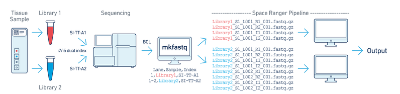
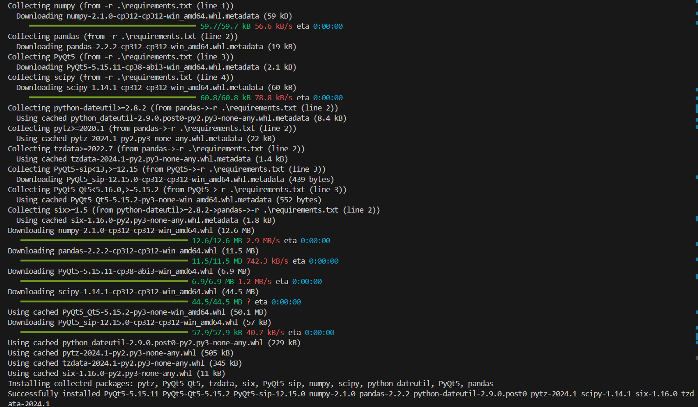

# NCBS Statistical Genomics Workshop - Spatial Data Analysis

The initial steps involve demultiplexing samples using ```spaceranger mkfastq```, followed by generating spatially resolved gene expression profiles with Spaceranger. This process includes aligning reads, counting UMIs, and assigning spatial coordinates to the data



Reference [link](https://www.10xgenomics.com/support/software/space-ranger/latest/analysis/inputs/fastqs-generating-fastqs)

After preprocessing with Spaceranger, the data is imported into R for analysis with Seurat and supplementary packages.

Next, we will explore cell type assignment, overlaying cell types on spatial plots, manual cell type annotation, and identifying differential gene expression across tissue regions.

## Spaceranger run

### mkfastq
1. BCL files are demultiplexed using a ```samplesheet.csv``` file that contains sample index IDs/sequences for different samples pooled together for sequencing on Illumina platform. This is done using ```spaceranger mkfastq``` function.

```
spaceranger mkfastq --id=tiny-bcl \
                    --run=the path of Illumina BCL run folder \
                    --csv=samplesheet.csv
```
Example ```samplesheet.csv```:


Running spaceranger mkfastq:

```
#switch from base environment to bcl2fastq environment
conda activate bcl2fastq_2.20
```
Example BCL file screenshot:


### count

Run spaceranger count to generate fastq files and other output files

```
spaceranger count --id="Visium_FFPE_Mouse_Brain" \
                 --description="Adult Mouse Brain (FFPE) using Mouse WTA Probe Set" \
                 --transcriptome=refdata-gex-mm10-2020-A \
                 --probe-set=Visium_Mouse_Transcriptome_Probe_Set_v1.0_mm10-2020-A.csv \
                 --fastqs=datasets/Visium_FFPE_Mouse_Brain_fastqs \
                 --image=datasets/Visium_FFPE_Mouse_Brain_image.jpg \
                 --slide=V11J26-127 \
                 --area=B1 \
                 --reorient-images=true \
                 --localcores=16 \
                 --localmem=128
```

link to download 10X Visium probe set [link](https://www.10xgenomics.com/support/cytassist-spatial-gene-expression/documentation/steps/probe-sets/visium-ffpe-probe-sets-files)

## Summary of the spatial sequencing run

[](https://cf.10xgenomics.com/samples/spatial-exp/2.0.1/CytAssist_11mm_FFPE_Human_Lung_Cancer/CytAssist_11mm_FFPE_Human_Lung_Cancer_web_summary.html)

## Setup Instructions

### Prerequisites

1. **Install R**:
   - Download and install R from [CRAN](https://cran.r-project.org/).

2. **Install RStudio**:
   - Download and install RStudio from [RStudio](https://rstudio.com/products/rstudio/download/).


## Step-By-Step Runthrough
### 1. Open RMD file and set the working directory
- In RStudio, go to _File -> Open File..._ and select the _"spatial_clustering.Rmd"_ file.
- Now we will run each code block one at a time.
- Ensure the working directory is set correctly. You can set it in the RMD file itself using:

```r
setwd("/path/to/your/directory")
```

### 2. Load Packages
```r
list.of.packages <- c("patchwork",
                      "HGNChelper",
                      "openxlsx",
                      "data.tree",
                      "hdf5r",
                      "Seurat",
                      "ggraph",
                      "igraph",
                      "tidyverse"
                      )

new.packages <- list.of.packages[!(list.of.packages %in% installed.packages()[,"Package"])]
if(length(new.packages)>0) install.packages(new.packages, dependencies = T)

# BioconductoR packages
list.of.bioc.packages<- c("scater")
new.packages.bioc <- list.of.bioc.packages[!(list.of.bioc.packages %in% installed.packages()[,"Package"])]

if(length(new.packages.bioc)>0)if (!requireNamespace("BiocManager")) install.packages("BiocManager")
BiocManager::install(new.packages.bioc, update = FALSE)

lapply(c(list.of.packages,list.of.bioc.packages), require, character.only = TRUE)
```
- **Output** - This block should install all the packages without any errors (ignore the Warnings)
- **Error resolution** - _"no package called 'package_name'"_ can be resolved using the command _install.packages("package_name")_


### 3. Load Data

example data can be downloaded from this [link](https://csciitd-my.sharepoint.com/:f:/g/personal/bez208514_iitd_ac_in/Evx4LMvx111Cp3wx9eVNaiQB1tzmMTvjtstln3hJ5mrnAA?e=MwkVrk)
```r
spatial_data <- Load10X_Spatial("/Enter/your/folder/location/outs",
                                filename = "CytAssist_11mm_FFPE_Human_Lung_Cancer_filtered_feature_bc_matrix.h5",
                                assay = "RNA",
                                slice = "slice2",
                                filter.matrix = TRUE,
                                to.upper = FALSE,
                                image = NULL)

```
- **Output** - This block should load the spatial transcriptomics data. You should see an object named "_spatial_data_" in your R environment
- **Make sure your working directory PATH and data PATH are correct**


### 4. **Normalize Data**
```r
spatial_data <- NormalizeData(spatial_data, normalization.method = "RC", scale.factor = 10000)
spatial_data <- FindVariableFeatures(spatial_data, selection.method = "vst", nfeatures = 2000)
```

Expression data is normalised using the formula below

$$
\text{Normalized Expression} = \log_{1p}\left(\frac{\text{Gene Expression}}{\text{Total Expression per Cell}} \times \text{scale.factor}\right)
$$

* The ```FindVariableFeatures``` function in Seurat is used to identify the most variable genes across cells in your dataset. These highly variable genes are typically more informative for downstream analyses like clustering, dimensionality reduction, and differential expression.

* ```selection.method = "vst"``` : This parameter specifies the method used to select the variable features. "vst" stands for “variance-stabilizing transformation,” which is a popular method in Seurat for identifying highly variable genes.

* ```nfeatures = 2000``` : This specifies the number of top variable genes to select. In this case, the function will identify the 2000 most variable genes across all cells in your dataset.

### 5. **Scale Data and Run PCA**
```r
spatial_data <- ScaleData(spatial_data, features = rownames(spatial_data))

spatial_data <- RunPCA(spatial_data, features = VariableFeatures(object = spatial_data))

```

* The formula for each gene (i) in each cell (j) is:

$$
\text{Scaled Expression}_{ij} = \frac{\text{Expression}_ij - \text{Mean Expression}_i}{\text{Standard Deviation}_i}
$$

What ```RunPCA``` Does

1.	**Simplifies Data**: Reduces the number of features (genes) by creating new “summary” features (principal components) that capture the most variation in your data.
2.	**Prepares for Analysis**: Makes it easier to see patterns in your data, which helps with things like clustering or creating plots.


### 6. **Cluster and Filter**
#### Clustering
```r
# Check number of PC components (we selected 10 PCs for downstream analysis, based on Elbow plot)
ElbowPlot(spatial_data)

# cluster and visualize
spatial_data <- FindNeighbors(spatial_data, dims = 1:8)
spatial_data <- FindClusters(spatial_data, resolution = 0.8)
spatial_data <- RunUMAP(spatial_data, dims = 1:8)

# saving a copy of spatial_data in another variable for upcoming analysis
spatial_data_with_unknown <- spatial_data
```

The ```ElbowPlot``` function in Seurat is used to help you decide how many principal components (PCs) to use for further analysis after performing PCA. It creates a plot showing the amount of variance explained by each principal component.

The ```FindNeighbors``` function in Seurat identifies the nearest neighbors of each cell in the dataset, which is a key step before clustering or other downstream analyses like UMAP or t-SNE. It builds a shared nearest neighbor (SNN) graph, which is then used by ```FindClusters``` to cluster cells based on their similarity.

The ```FindClusters``` clusters the cells based on the similarity of expression. ```resolution``` indicates how fine clusters to make. Higher is the resolution, more clusters are made. 

#### Visualization
```r
clusters_plot <- DimPlot(spatial_data, reduction = "umap")
clusters_plot
```


### 7. **Cell Type Assignment - Annotations**

#### Loading Database and Prerequisite files
```r
# CELL TYPE ASSIGNMENT
# load gene set preparation function
source("https://raw.githubusercontent.com/IanevskiAleksandr/sc-type/master/R/gene_sets_prepare.R")
# load cell type annotation function
source("https://raw.githubusercontent.com/IanevskiAleksandr/sc-type/master/R/sctype_score_.R")

#source("~/Downloads/sctype_score_.R")
#source("~/Downloads/gene_sets_prepare.R")

#In addition, provide a tissue type your data belongs to:
# DB file
db_ = "https://raw.githubusercontent.com/IanevskiAleksandr/sc-type/master/ScTypeDB_full.xlsx";
```
- **Understanding Code** - These lines load the R scripts for gene set preparation and cell type annotation directly from a GitHub repository. The source function is used to execute the R scripts from the provided URLs.


#### Detecting Tissue-type
```r
#auto-detect tissue
source("https://raw.githubusercontent.com/IanevskiAleksandr/sc-type/master/R/auto_detect_tissue_type.R")
#tissue_guess = auto_detect_tissue_type(path_to_db_file = db_, seuratObject = spatial_data, scaled = TRUE, assay = "RNA")  # if scaled = TRUE, make sure the data is scaled, as seuratObject[[assay]]@scale.data is used. If you just created a Seurat object, without any scaling and normalization, set scaled = FALSE, seuratObject[[assay]]@counts will be used         

# Select tissue type : Default: "Immune system"
# we could make a drop-down for this
tissue = "Lung" # e.g. Immune system,Pancreas,Liver,Eye,Kidney,Brain,Lung,Adrenal,Heart,Intestine,Muscle,Placenta,Spleen,Stomach,Thymus 
```
- **Understanding Code** - This part sources the script for auto-detecting the tissue type. The commented line shows how to use the auto_detect_tissue_type function to guess the tissue type of the data based on the provided database file and the Seurat object containing the spatial transcriptomics data


#### Prepare Gene Sets and assign cell type
```r
# prepare gene sets
gs_list = gene_sets_prepare(db_, tissue)

#ASSIGN CELL-TYPES TO CLUSTERS
# get cell-type by cell matrix
spatial_data[["RNA3"]] <- as(object = spatial_data[["RNA"]], Class = "Assay")

es.max = sctype_score(scRNAseqData = spatial_data[["RNA3"]]@scale.data,
                      scaled = TRUE,
                      gs = gs_list$gs_positive,
                      gs2 = gs_list$gs_negative)
```
- **Understanding Code** - In these lines:
The RNA assay in the spatial_data object is converted to a new assay called "RNA3".
The sctype_score function is used to score each cell for the likelihood of belonging to specific cell types based on the prepared gene sets. The scRNAseqData parameter should correspond to the scaled data of the RNA assay.


#### Merge Results by CLusters
```r
# merge by cluster
cL_resutls = do.call("rbind", lapply(unique(spatial_data@meta.data$seurat_clusters), function(cl){
  # For every cluster, calculates the cluster scores
  # to identify the cell type
  es.max.cl = sort(rowSums(es.max[ ,rownames(spatial_data@meta.data[spatial_data@meta.data$seurat_clusters==cl, ])]), decreasing = !0)
  head(data.frame(cluster = cl, type = names(es.max.cl), scores = es.max.cl, ncells = sum(spatial_data@meta.data$seurat_clusters==cl)), 10)
}))
sctype_scores = cL_resutls %>% group_by(cluster) %>% top_n(n = 1, wt = scores)  
```
- **Understanding Code** - This part processes the scores:
It calculates the total scores for each cell type within each cluster.
It organizes the results into a data frame where each row represents a cluster and the top-scoring cell types within that cluster.


#### Low-confidence clusters set to unknown type
```r
# set low-confident (low ScType score) clusters to "unknown"
sctype_scores$type[as.numeric(as.character(sctype_scores$scores)) < sctype_scores$ncells/4] = "Unknown"
print(sctype_scores[,1:3])
```
- **Understanding Code** - This final part adjusts the results:
It labels clusters with low-confidence scores as "Unknown". A threshold is set such that if a cell type's score is less than one-fourth of the number of cells in the cluster, it is marked as "Unknown".
It prints the relevant columns of the final scores data frame.


- **Sample Output**
```r
# A tibble: 17 × 3
# Groups:   cluster [17]
   cluster type                              scores
   <fct>   <chr>                              <dbl>
 1 9       Airway goblet cells               144.  
 2 6       Endothelial cell                  460.  
 3 3       Unknown                            -9.31
 4 8       Unknown                           -17.0 
 5 1       Unknown                            75.7 
 6 4       Unknown                            57.8 
 7 16      Immune system cells                41.4 
 8 7       Epithelial cells                  286.  
 9 11      Immune system cells              1569.  
10 2       Unknown                           -12.2 
11 13      Airway goblet cells               120.  
12 10      Unknown                            46.4 
13 0       Unknown                           119.  
14 5       Endothelial cell                  244.  
15 12      Pulmonary alveolar type II cells 1951.  
16 14      Epithelial cells                  248.  
17 15      Fibroblasts                      1101.  
```


### 8. **Plotting and Visualizations**
```r
## OVERLAYING IDENTIFIED CELL-TYPES ON PLOTS
spatial_data@meta.data$customclassif = ""
for(j in unique(sctype_scores$cluster)){
  cl_type = sctype_scores[sctype_scores$cluster==j,]; 
  spatial_data@meta.data$customclassif[spatial_data@meta.data$seurat_clusters == j] = as.character(cl_type$type[1])
}

#DimPlot(spatial_data, reduction = "umap", label = TRUE, repel = TRUE, group.by = 'customclassif')

ccolss= c("#5f75ae","#92bbb8","#64a841","#e5486e","#de8e06","#eccf5a","#b5aa0f","#e4b680","#7ba39d","#b15928","#ffff99", "#6a3d9a","#cab2d6","#ff7f00","#fdbf6f","#e31a1c","#fb9a99","#33a02c","#b2df8a","#1f78b4","#a6cee3")

# UMAP and spatial plot with inferred cell-types
Idents(spatial_data)=spatial_data@meta.data$customclassif
p1 <- DimPlot(spatial_data, reduction = "umap", label = TRUE, cols = ccolss)
names(ccolss) <- unique(Idents(spatial_data))
p2 <- SpatialDimPlot(spatial_data, label = TRUE, label.size = 3, cols = ccolss)
p1 + p2
```
- **Sample Output**


### 9. **Marker Gene Identification**

```{r}
clusters_plot + p1
```

```r
# 0 -is unknown
# 6 -is cancer stem cells
cluster_of_interest <- c(0,6)

# To find markers between specific clusters; Here 1 and 2
selected_markers <- FindMarkers(spatial_data_with_unknown, ident.1 = cluster_of_interest[1], ident.2 = cluster_of_interest[2], only.pos = TRUE, min.pct = 0.25, logfc.threshold = 0.25)
# To filter significant ones among the identified markers
selected_filtered_genes <- subset(selected_markers, p_val_adj <= 0.05 & abs(avg_log2FC) >=1)
selected_filtered_genes
```
- **Understanding code** - UMAP (Uniform Manifold Approximation and Projection) is used to reduce the dimensionality of the data and visualize clusters in a 2D space. The DimPlot function generates a plot showing the spatial distribution of these clusters. UMAP helps in visualizing the complex high-dimensional data in a comprehensible manner, highlighting the relationships between different cell clusters.

- Seurat can help you ```FindMarkers``` that define clusters via differential expression (DE). By default, it identifies positive and negative markers of a single cluster (specified in ident.1, ident.2), compared to all other cells. 


```r
markers <- FindAllMarkers(spatial_data_with_unknown, only.pos = TRUE, min.pct = 0.25, logfc.threshold = 0.25)

filtered_genes <- subset(markers, p_val_adj <= 0.05 & abs(avg_log2FC) >=1)
filtered_genes
```
- **Understanding code** - These lines identify marker genes that distinguish between clusters of interest. The ```FindAllMarkers``` function in Seurat is used to identify differentially expressed genes (markers) between clusters. It compares each cluster against all other clusters and returns the top marker genes for each cluster. 
Further filtering refines the list of significant marker genes based on adjusted p-values and expression changes. Identifying marker genes helps understand the biological characteristics and differences between cell clusters. It finally assigns each cell to a specific cluster, providing a comprehensive overview of the cell population's structure.

- **Sample Output**
```md
## Computing nearest neighbor graph
## Computing SNN
## Modularity Optimizer version 1.3.0 by Ludo Waltman and Nees Jan van Eck
## 
## Number of nodes: 2719
## Number of edges: 107772
## 
## Running Louvain algorithm...
## Maximum modularity in 10 random starts: 0.7744
## Number of communities: 10
## Elapsed time: 0 seconds
## 12:00:45 UMAP embedding parameters a = 0.9922 b = 1.112
## Found more than one class "dist" in cache; using the first, from namespace 'BiocGenerics'
## Also defined by 'spam'
## 12:00:45 Read 2719 rows and found 30 numeric columns
## 12:00:45 Using Annoy for neighbor search, n_neighbors = 30
## Found more than one class "dist" in cache; using the first, from namespace 'BiocGenerics'
## Also defined by 'spam'
## 12:00:45 Building Annoy index with metric = cosine, n_trees = 50
## 0%   10   20   30   40   50   60   70   80   90   100%
## [----|----|----|----|----|----|----|----|----|----|
## **************************************************|
## 12:00:45 Writing NN index file to temp file /tmp/Rtmp8PwOGO/file905a01aea1d51
## 12:00:45 Searching Annoy index using 1 thread, search_k = 3000
## 12:00:45 Annoy recall = 100%
## 12:00:46 Commencing smooth kNN distance calibration using 1 thread with target n_neighbors = 30
## 12:00:46 Initializing from normalized Laplacian + noise (using RSpectra)
## 12:00:46 Commencing optimization for 500 epochs, with 118816 positive edges
## 12:00:49 Optimization finished
## Calculating cluster 0
## Calculating cluster 1
## Calculating cluster 2
## Calculating cluster 3
## Calculating cluster 4
## Calculating cluster 5
## Calculating cluster 6
## Calculating cluster 7
## Calculating cluster 8
## Calculating cluster 9
```


### 10. **Dot Plot Visualizations**
```r
DotPlot(spatial_data, features = c("CLDN5","HIGD1B","IQCG","DRC3","DNAI2","FABP6","DNAAF1","MUC4","RARRES2","SCGB1A1","SFTPA2","SFTPB","SFTPC"), dot.scale = 4) #ACC_markers_fromGSEA
```
- **Sample Output**


### 11. **Dot Plot - 2**
```r
DotPlot(spatial_data, features = c("CLDN5","HIGD1B","IQCG","DRC3","DNAI2","FABP6","DNAAF1","MUC4","RARRES2","SCGB1A1","SFTPA2","SFTPB","SFTPC"), dot.scale = 4) #ACC_markers_fromGSEA
```

- **Sample Output**


- ###  **Loupe Browser**
    - Link to download loupe browser [link](https://www.10xgenomics.com/support/software/loupe-browser/downloads/eula?closeUrl=%2Fsupport%2Fsoftware%2Floupe-browser&lastTouchOfferName=Loupe%20Browser&lastTouchOfferType=Software%20Download&product=chromium&redirectUrl=%2Fsupport%2Fsoftware%2Floupe-browser%2Fdownloads)

    - **Annotation drawbacks of loupe browser**


### 12. **Annotation Using Pratyaksha**
- Make sure you have Python (>=2.7) installed on the system
- Follow the below code segments to install the dependencies and run the software files
- Sample Dataset MiST - https://drive.google.com/drive/folders/1nRNCgp-DcNkb1zBIFAael0uAt_iDoH7S?usp=sharing
- **hires_image and lowres_image** - These files are downsampled versions of the original, full-resolution image inputs provided by the user. Downsampling is accomplished by box filtering, which averages RGB values in patches of pixels in the full-resolution image to obtain an RGB value of one pixel in the downsampled image. The downsampled images maintain the aspect ratio of the original image. The longest dimension of __tissue_hires_image.png__ is as follows:

Visium v2 slide, 6.5 mm Capture Area -	2,000 pixels
Visium v2 slide, 11 mm Capture Area -	4,000 pixels
Visium HD slide, 6.5 mm Capture Area -	6,000 pixels

Irrespective of the slide type, the longest dimension of __tissue_lowres_image.png__ is always 600 pixels.

- **Installing Dependencies**
```bash
pip install -r requirements.txt
```

- **Sample Output**


- **Running Pratyaskha**
```
python main.py
```
- **Sample Output**


- **Pratyaksha Guide**
  


### 13. **Annotation Guide for Pratyaksha**

- **Select the image to annotate**


- **Select the tissue_positions.csv file (mapping file)**


- **Input the corresponding scale factor from scale_factors_json.json file**


- **Start Annotation and extract barcodes once done**


#### Contact Information:
https://sites.google.com/view/fungel-iitd/lab-members?authuser=0
